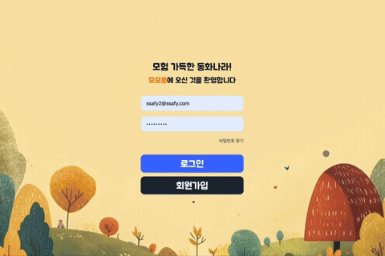

# 모모퐁
## 프로젝트 진행 기간
### 2025.01.13 ~ 2025.02.20(6주)

## 🏝️ Introduction
### 모험 가득한 "동화나라"로 퐁당!
친구와 읽고, 그리고, 소통하는 **정서교육** 플랫폼, <span style="color:orange">**모모퐁**</span>입니다!

### 기획 배경
> **유아의 주중 유튜브 1일 사용시간에 대해서 분석한 결과, 평균적으로 주중100-130분 사이로 1시간 이상을 시청하는 것으로 나타났다.** <br><br>전진호, 「유튜브(YouTube) 이용 형태가유아 보호자의 미디어 교육 경험과필요성 차이 연구」, 유아교육ㆍ보육복지 연구, 26권 3호, p30

> **미디어 이용 시간이 증가할수록 아동의 학교적응 수준이 낮아지는 것으로 드러났다.** <br><br>이민지; 송주현 , 「코로나19로 인한 아동의 미디어 이용 및 신체활동이 인지적, 정서적 집행기능을 매개로 학교적응에 미치는 영향」,
육아정책연구, 17권 1호, p183 


**_하지만 지금, 우리는 아동을 미디어와 완벽히 분리시킬 수 없지 않나요?_**
흐름을 피할 수 없다면, 그것을 교육적으로 활용해야만 합니다.

#### 🦊<span style="color:orange">**모모퐁**</span>은 이렇습니다.
-  동화 속 인물에 대한 이해와 공감을 바탕으로 아이의 정서 발달에 도움이 됩니다!
- 친구와 함께 읽고 그리는 경험을 통해 협동심을 길러요
- 동화 속에 등장하는 오브젝트를 상상해 보며 창의력을 발달시켜요
- 가족과 함께 동화 나라를 여행할 수도 있어요!


### 1) 페르소나


### 2) 고객 여정 지도


### 3) 시장 조사
- 시장 조사 결과 동화 구연 서비스는 다양하게 서비스되고 있었지만 RTC를 활용한 서비스는 확인하지 못함
- 그림을 '함께'그리고 동화 속에 등장시키는 서비스 X

### 4) 차별점
- 친구와의 실시간 소통 ✔️
- 동화 속, 동화 밖 그림판 이용 ✔️
- 동화 속 등장인물에게 편지 보내기 ✔️

### 5) 기대효과
#### 🧒아이 측면
- 동화 대사 읽기를 통한 언어 발달 촉진
- 등장인물에게 몰입하고 친구와의 교류를 통한 정서 발달
- 협력을 통한 사회성 발달

#### 👫부모 측면
- 효과적인 교육 도구로써 활용 가능
- 아이의 독서 경향성 파악 가능
- 부모와 자녀의 새로운 소통 창구


## 1️⃣ 프로젝트 구조
### 사용한 기술 스택
- **Front-end** <br>


- **Back-end** <br>


- **Infra** <br>


- **Collaboration Tools** <br>


---

### Back-end
```
src
├─main
│  ├─generated
│  ├─java
│  │  └─com
│  │      └─ssafy
│  │          └─project
│  │              ├─common
│  │              ├─config
│  │              ├─controller
│  │              ├─dao
│  │              ├─domain
│  │              │  ├─book
│  │              │  ├─record
│  │              │  └─type
│  │              ├─dto
│  │              │  ├─book
│  │              │  ├─friend
│  │              │  ├─invitation
│  │              │  ├─record
│  │              │  ├─report
│  │              │  └─user
│  │              ├─exception
│  │              │  └─friend
│  │              ├─firebase
│  │              ├─handler
│  │              ├─repository
│  │              ├─security
│  │              └─service
│  └─resources
└─test
    └─java
        └─com
            └─ssafy
                └─project
                    ├─security
                    └─service
```
### Front-end
```
 ├── src
 ├──  │   api
 ├──  │    │   axios.ts
 ├──  │    │   storyApi.ts
 ├──  │   App.css
 ├──  │   App.tsx
 ├──  │   components
 ├──  │    │   auth
 ├──  │    │    │   CustomInput.tsx
 ├──  │    │   BackgroundMusic.tsx
 ├──  │    │   common
 ├──  │    │    │   buttons
 ├──  │    │    │    │   ...
 ├──  │    │    │   LoadingPage.tsx
 ├──  │    │    │   modals
 ├──  │    │    │    │   AddFriendModal.tsx
 ├──  │    │    │    │   ...
 ├──  │    │    │   multiplayPages
 ├──  │    │    │    │   InvitationWaitPage.tsx
 ├──  │    │    │   numberpad
 ├──  │    │    │    │   NumberPad.tsx
 ├──  │    │    │   PopText.tsx
 ├──  │    │    │   ...
 ├──  │    │   drawing
 ├──  │    │    │   canvasComponents
 ├──  │    │    │    │   ...
 ├──  │    │    │   data
 ├──  │    │    │    │   colorList.ts
 ├──  │    │    │   drawingMode
 ├──  │    │    │   hooks
 ├──  │    │    │    │   useSocketStore.ts
 ├──  │    │    │   modeSelection
 ├──  │    │    │   types
 ├──  │    │    │    │   custom.d.ts
 ├──  │    │    │    │   ...
 ├──  │    │   friends
 ├──  │    │    │   FriendList.tsx
 ├──  │    │    │   ...
 ├──  │    │   ImageUpload.tsx
 ├──  │    │   myhouse
 ├──  │    │    │   mybookstory.tsx
 ├──  │    │    │   ...
 ├──  │    │   parentReport
 ├──  │    │    │   components
 ├──  │    │    │    │   DonutChart.tsx
 ├──  │    │    │   tabs
 ├──  │    │    │    │   ...
 ├──  │    │   ProtectedRoute.tsx
 ├──  │    │   stories
 ├──  │    │    │   AudioPlayer.tsx
 ├──  │    │    │   data
 ├──  │    │    │    │   cinderella.ts
 ├──  │    │    │   ModeSelection
 ├──  │    │    │   StoryContainer.tsx
 ├──  │    │    │   StoryMode
 ├──  │    │    │    │   ...
 ├──  │    │    │   types
 ├──  │    │    │    │   story.ts
 ├──  │    │    │   utils
 ├──  │    │   video
 ├──  │    │    │   AudioComponent.tsx
 ├──  │    │    │   ...
 ├──  │   env.d.ts
 ├──  │   hooks
 ├──  │    │   useFirebaseMessaging.ts
 ├──  │   index.css
 ├──  │   lib
 ├──  │    │   utils.ts
 ├──  │   main.tsx
 ├──  │   pages
 ├──  │    │   auth
 ├──  │    │    │   Login.tsx
 ├──  │    │    │   SignUp.tsx
 ├──  │    │   Drawing.tsx
 ├──  │    │   ...
 ├──  │    │   subAccount
 ├──  │    │    │   SubAccountForm.tsx
 ├──  │    │    │   ...
 ├──  │    │   Test.tsx
 ├──  │   services
 ├──  │    │   firebaseService.ts
 ├──  │    │   tokenService.ts
 ├──  │   stores
 ├──  │    │   authStore.ts
 ├──  │    │   book
 ├──  │    │    │   bookContentStore.ts
 ├──  │    │    │   ...
 ├──  │    │   drawing
 ├──  │    │    │   base64ToBlob.ts
 ├──  │    │    │   ...
 ├──  │    │   friendListStore.ts
 ├──  │    │   letter
 ├──  │    │    │   letterStore.ts
 ├──  │    │    │   recentLetterStore.ts
 ├──  │    │   loginStore.ts
 ├──  │    │   ...
 ├──  │   types
 ├──  │    │   auth.ts
 ├──  │    │   ...
 ├──  │   utils
 ├──  │    │   auth.ts
 ├──  │    │   bookS3
 ├──  │    │    │   bookRecordCreate.ts
 ├──  │    │    │   ...
 ├──  │    │   drawingS3
 ├──  │    │    │   drawingLoad.ts
 ├──  │    │    │   ...
 ├──  │    │   letterS3
 ├──  │    │    │   audioLoad.ts
 ├──  │    │    │   ...
 ├── tailwind.config.js
 ├── tsconfig.json
 ├── tsconfig.node.json
 ├── vite.config.ts

```

## 2️⃣ 산출물
### 📌 ERD


### 📌 시스템 아키텍처


### Figma
[🍬Figma로 이동](https://www.figma.com/design/PbHZbvgzpNscVgBcnAUBdU/%EC%82%BC%EC%A1%B0%ED%95%91-%EA%B3%B5%ED%86%B5?node-id=231-460&t=PIwqd8sr5L64774w-1)

## 3️⃣ 주요 기능 소개
#### 1. 로그인
- 부모(메인) 계정을 통한 자식(서브) 계정 로그인 기능
- 자식 계정 로그인 이후 API는 인터셉터 통해 자식 계정 토큰으로 자동 요청


#### 2. 리포트
- 서브 계정 페이지에서 간단한 계산식으로 접근 가능
- 아이의 주간 활동 통계 및 활동 결과물 확인/다운로드 가능


#### 3. 친구 목록 조회 및 추가
- radis를 통해 관리되는 친구의 활동 상태 확인 가능
- 내부 키패드 및 코드 통해 친구 추가 가능<br>


#### 4. 친구 초대 기능
- FCM 알림을 통한 동화/그림 함께하기 초대
- 토스트를 통해 초대 상태 확인 가능


#### 5. 동화 컨텐츠
- openVidu3를 통한 비디오룸 입장 및 동화 데이터/녹음 상태 공유
- 아이에게 배정된 역할 대사 등장 시 녹음 기능 활성화
- 오브젝트 함께 그리기 기능
- 그린 오브젝트는 동화 속에 등장


#### 6. 그림판
- Socket.io 및 Canvas API 활용한 그리기 기능
- 자유 그리기 또는 도안 색칠 가능
- 결과물은 나의 집에 전시되어 보관 가능


#### 7. 등장인물에게 편지 보내기
- 함께 읽기 후 본인이 몰입해 보았던 등장인물에게 녹음을 통한 편지 보내기 가능
- Google Cloud Speech API로 텍스트 변경 -> Chat GPT에게 프롬프트와 함께 전송하여 편지 생성
 

#### 8. 동화 저장 및 다시보기
- 함께 읽은 책의 내용(그림, 목소리) 저장하여 다시보기 제공
- 등장인물에게 받은 편지는 언제든 나의 집-편지함에서 다시보기, 녹음 편지 다시 듣기 가능


## 3️⃣ Jira Sprint
### Step1. Sub-PTJ 1
**[1월 13일 - 1월 17일]**
| **날짜** | **전체** | **구현진** | **박준현** | **윤지원** | **이하리** | **정은아** | **허정은** |
| --- | --- | --- | --- | --- | --- | --- | --- |
| 1/13 | 프로젝트 주제 회의 및 피드백, 컨설턴트 코치님 1차 사전 미팅 | 아이디어 주제 관련 조사, JPA 상속 관계 학습 | Docker 학습 , 아키텍쳐 조사 | 관련 자료 조사, 리액트 상태 관리 학습, 기술스택 조사  | 아이디어 주제 관련 기존 유사 서비스 조사, React컴포넌트 학습 | 사유결석(독감) | 아이디어 구체화 및 기존 유사 서비스 조사, React 학습 |
| 1/14 | 프로젝트 주제 회의 및 피드백 | 인프라 기획 및 컨펌, Spring Security 로그인 학습 | AWS 학습 및 인프라 기획 및 1차 컨펌 | 피그마 컴포넌트 관리 학습, 아이디어 뒷받침할 논문 근거 조사 | 아이디어 기획, 개발 배경조사, 프론트 기술스택 설정 | PM 특강, git branch, merge등 개념 학습, 인프라 기획 및 컨펌 | 아이디어 발전 및 구체화, 기존 유사 서비스 조사 |
| 1/15 | 프로젝트 주제 최종 채택 , 컨설턴트 코치님 2차 사전 미팅, 기존 유사 서비스 조사 | 기존 유사 서비스 조사, Spring Security 로그인 학습 및 정리 | 백엔드 기술 스택 회의 및 결정 | 아이디어 차별성 구체화, React 메모이제이션 학습 | React 초기 프로젝트 구축 및 React Hooks 학습 | PM 특강, 스프링부트에서 JPA로 데이터 베이스 다루기 학습, BE 기술스택 회의 및 결정 | 아이디어 방향성 변경 및 구체화, 기존 유사 서비스 조사 |
| 1/16 | 사용자 워크플로우 제작, 프로젝트 세부 사항 회의 | 기술적 실현 가능성 분석 및 평가, Redis 개념 학습 | 아이디어 기술적 실현 가능성 분석 및 1차 컨펌 | FE 프로젝트 기본 개발환경 구축 및 1차 공유, 피그마 기반 코드작성 학습  | 3d 캐릭터 디자인 조사,React 속성 및 상태 학습 | 음성인식 테스트 코드 작성, 기술적 실현 가능성 분석 및 평가 | 기존 유사 서비스 조사, 프로젝트 구체화 |
| 1/17 | 프로젝트 기획 정리 및 사용 기술 스택 정리 | RefreshToken Redis 저장 방식 학습 | Jenkins 기초 학습 , 실험 세팅 | ESLint airbnb ts 규칙 적용, 타입스크립트 기초 학습 | React 배포 학습, 리액트(라이프사이클, 최적화 학습) | Redis 개념 학습 및 설치, ERD 구상 | React 기존 예제 프로젝트 학습 |
### Step2. Sub-PTJ 2
**[1월 20일 - 1월 24일]**
| **날짜** | **전체** | **구현진** | **박준현** | **윤지원** | **이하리** | **정은아** | **허정은** |
| --- | --- | --- | --- | --- | --- | --- | --- |
| 1/20 | 기능 명세서 작성 | 기능 명세서 작성, ERD 설계 | Docker 학습 , 아키텍쳐 조사 | 와이어프레임 설계 시작 | 스토리모드 메인 컴포넌트 설계 및 구현, 모드 선택 화면 UI/UX 개발, 싱글모드/함께모드 라우팅 구조 구현 | ERD설계 | 아이디어 회의, Socket.io 공식 문서 학습 |
| 1/21 | ERD 설계 및 와이어프레임 | ERD 설계, API 명세서 작성 | AWS 학습 및 인프라 기획 및 1차 컨펌 | 피그마 컴포넌트 생성 | 스토리 동화 삽화 생성 및 컴포넌트 개발, 반응형 레이아웃 구현, 기본 인터페이스 디자인 적용 | ERD 설계 및 , 스프링 부트에서 JPA로 데이터 베이스 다루기 학습 | 아이디어 회의, Socket.io 공식 문서 학습 및 그림판 기능 개발 |
| 1/22 | ERD 설계 및 와이어프레임 | ERD 설계, API 명세서 작성 | 백엔드 기술 스택 회의 및 결정 | 피그마 와이어프레임 완성 | 스토리 텍스트 데이터 구조화, 텍스트 컨텐츠 표시 시스템 구현, 스토리 진행 상태 관리 | ERD 설계 및 API 명세서 작성 | Socket.io 연동 그림판 프로젝트 개발 |
| 1/23 | API 명세서 작성 및 목업 작업 | API 명세서 작성, 개발 사전 세팅 | 아이디어 기술적 실현 가능성 분석 및 1차 컨펌 | 와이어프레임 기반 목업 디자인  | 오디오 플레이어 컴포넌트 개발, 음성 재생 제어 기능 구현, 오디오 상태 관리 시스템 구축 | API 명세서 작성 및 S3 학습 | Fabric.js 기반 Socket.io 연동 그림판 프로젝트 개발 |
| 1/24 | API 개발 및 각 기능 개발 준비/진행 | 부모 회원가입/로그인 API 개발 | Jenkins 기초 학습 , 실험 세팅 | 목업 마무리, 동화 각색, 관련 자료 수집 | 친구 초대 시스템 구현, 실시간 참여자 관리, 멀티플레이어 세션 관리 | API 명세서 마무리 및 오픈 비두 튜토리얼 코드 뜯어보기 | Canvas 기반 Socket.io 연동 그림판 프로젝트 고도화 |

### Step3. Sub-PTJ 2
**[1월 27일 - 1월 31일]**
| **날짜** | **전체** | **구현진** | **박준현** | **윤지원** | **이하리** | **정은아** | **허정은** |
| --- | --- | --- | --- | --- | --- | --- | --- |
| 1/27 | 개발 및 주요 기능 테스트/학습 | 부모 회원 정보 수정 API, 자식 회원가입/로그인 API 개발 | Nginx 학습 | 공통 버튼 컴포넌트 개발  | 싱글모드 전용 삽화 시스템 구현, 페이지 전환 애니메이션 추가, 개인 진행 상태 저장 기능 | 진행 상황 공유 및 회의, 음성 인식을 위한 stt 조사 | React와 Socket.io 임시 서버 연결 테스트 |
| 1/28 | 주요 기능 개발 | Refresh Token 재발급 API, 자식 회원 정보 수정 API 개발 | Openvidu 학습 및 튜토리얼 코드 테스트 | 키패드, 타이머 컴포넌트 개발 | 직관적인 페이지 전환 UI 구현, 네비게이션 컨트롤 최적화, 진행 상태 표시 기능 | 진행 상황 공유 및 회의, google cloud stt api 사용 및 오픈비두 위에서 동작하도록 코드 수정 | React 기반 Socket.io 연동 canvas 기능 개발 |
| 1/29 | 주요 기능 개발 | 회원가입 테스트 코드 작성 | JPA 학습 및 컨벤션 설정 | 공통 모달 컴포넌트 구현 | 싱글모드 전용 음성 재생 기능, 자동 재생 시스템 구현, 오디오 동기화 처리 | 오픈비두 위에서 stt api의 오류 수정 | 다중 레이어 캔버스 생성, 이미지 저장 기능 추가 |
| 1/30 | 주요 기능 개발 및 인프라 설정 | Access Token 블랙리스트 관리 로직 추가 | 방화벽 설정, 배포 서버 DB 협업 설정 및 권한 부여  | 기타 공통 컴포넌트들 구현  | 함께모드 전용 삽화 시스템, 실시간 페이지 동기화, 참여자 간 화면 공유 | letter api 개발 | 실시간 연동 canvas에 비율에 따른 좌표 적용, 그리기 화면 개발 |
| 1/31 | 주요 기능 개발 및 인프라 설정, 오류 해결 | 동화 조회 API, 친구 추가 API 개발 | EC2 Docker Jenkins , Git Lab 연결 | TailwindCSS 제대로 적용되지 않는 문제 해결 | 함께모드 전용 음성 재생 시스템, 참여자 간 오디오 동기화, 실시간 재생 상태 공유 | gpt api를 통해 답장 받는 기능 개발 | canvas 연동 오류 수정 및 도안 데이터 생성 |

### Step4. Sub-PTJ 3
**[2월 3일 - 2월 7일]**
| **날짜** | **전체** | **구현진** | **박준현** | **윤지원** | **이하리** | **정은아** | **허정은** |
| --- | --- | --- | --- | --- | --- | --- | --- |
| 2/3 | 발표 내용 정리 및 장표 준비, 기능 개발 | 부모 계정으로 자식 조회하는 API, 친구 추가 API 개발 | 배포환경 Spring 설정 및 배포 | 부모 회원가입, 로그인 기능 구현  | 내레이션 자동 재생, 스토리 함께모드 페이지 넘김 처리, 권한 기반 기능 제어 | 편지 답장 조회 API 개발 | 그리기 및 친구 선택 Zustand 상태 관리 적용, Socket.io 기능 분리 |
| 2/4 | 발표 스크립트 작성 및 장표 준비 완료 | 친구 요청 목록 API, 동화 초대 API 개발 | Nginx로 프론트엔드 배포, SSL/TLS 적용 | 서브 계정 생성 폼 구현 | 스토리 함께모드 녹음 기능 추가, role1/role2 구분 및 할당, 역할별 대사 표시 시스템 | S3 업로드 관련 letter controller 수정 | 보호자 리포트 화면 생성, canvas에 상태에 따른 socket 연결 상태 관리 |
| 2/5 | 중간 발표 | 동화 초대 API 개발, 웹 소켓 학습 | Jenkins - 백엔드, 프론트엔드 CI/CD 구축 | 친구 목록 및 추가 컴포넌트 개발 | MediaRecorder API를 활용한 녹음 기능, 스토리 함께모드 역할 배정 기능 추가, 역할 배정 기능 수정 | S3업로드 방식 학습 및 관련 API 수정 | 저장 및 생성 이미지 형식 webp로 수정 |
| 2/6 | 주요 기능 개발 | 동화 초대/수락/거절 API 개발 | 배포환경 Redis 설정, Jenkins 보안 설정 | 부모/자식 API 헤더 토큰 적용 우선순위 로직 수정 | 역할별 턴 관리 시스템, 스토리 함께모드 오픈비두 기능 추가, 라이브킷 라이브러리 비디오, 오디오 스트리밍 구현 | 서브 컨텐츠 그림 조회 API 개발 | 나의 집 디자인 수정 |
| 2/7 | RTC관련 기능 개발 및 점검, 개발 | 동화 초대 수락 후 OpenVidu 연결 기능 추가 | Openvidu 배포 , 인프라 점검 | 친구 관련 기능 API 연결 | 참가자별 비디오 스트림 처리 및 표시, 실시간 동기화 구현, 참가자 간 동기화된 페이지 전환 | 서브 컨텐츠 그림 저장 API 개발 및 그림 도안 생성 | 동화 데이터 Zustand 적용 및 화면 전환 로직 수정 |

### Step5. Sub-PTJ 3
**[2월 10일 - 2월 14일]**
| **날짜** | **전체** | **구현진** | **박준현** | **윤지원** | **이하리** | **정은아** | **허정은** |
| --- | --- | --- | --- | --- | --- | --- | --- |
| 2/10 | 기능 구현 및 사용 기술 관련 학습 | Swagger UI 설정, 자식 로그인 JWT 적용, FCM 학습 | SocketIO 설정 및 메인 컨텐츠 저장 기능 개발 | Protected Routing 적용, 로그인 로그아웃 오류 수정  | 내레이션 자동 재생, 스토리 함께모드 페이지 넘김 처리, 권한 기반 기능 제어 | CloudFront 학습 및 적용 | 이미지 S3 업로드 및 조회 기능 구현, 편지 저장 및 조회 기능 구현 |
| 2/11 | 동화 관련 메인 기능 개발 | 동화 초대에 FCM 적용, 편지 초대/수락/거절 API 개발 | 동화 함께 읽기 개발 | FCM 알림 통한 함께하기 기능 구현 | 스토리 함께모드 녹음 기능 추가, role1/role2 구분 및 할당, 역할별 대사 표시 시스템 | cloudfront로 동화음성조회 API 개발 및 S3에 동화 음성 업로드 | STT 기능 연결 및 오디오 S3 저장 및 조회 기능 구현, 그림 API 연결 |
| 2/12 | FCM 알림 적용 및 동화 관련 기능 개발 | 메인 컨텐츠 동화 조회 API 개발 | 동화 함께 읽기 개발 | FCM 알림 통한 함께하기 기능 구현 | MediaRecorder API를 활용한 녹음 기능, 스토리 함께모드 역할 배정 기능 추가, 역할 배정 기능 수정 | 편지 상세조회 API 구현 | 동화 API 연결, 편지 알림 화면 생성 |
| 2/13 | 동화 관련 메인 기능 개발 |  메인 컨텐츠 동화 조회 API, 도안 목록 API 개발 | 동화 함께 읽기 개발 | FCM 초대 openVidu, Socket으로 연결 | 역할별 턴 관리 시스템, 스토리 함께모드 오픈비두 기능 추가, 라이브킷 라이브러리 비디오, 오디오 스트리밍 구현 | 서브컨텐츠 그림관련 API 추가 개발 및 수정 | 동화 저장 기능 개발 |
| 2/14 | 참가자 영상 연결/동기화 및 함께 그리기 기능 개선 및 초대 연결 | 참여한 동화 목록 API 개발 | 참가자별 비디오 스트림 처리 및 표시, 실시간 동기화 구현, 참가자 간 동기화된 페이지 전환 | 그리기 연동, 친구 목록 동기화 해결 | 참가자별 비디오 스트림 처리 및 표시, 실시간 동기화 구현, 참가자 간 동기화된 페이지 전환 | 부모 페이지 편지, 그림 조회 API 구현 및 도안 생성 | 디자인 개선 |

### Step6. Sub-PTJ 3
**[2월 17일 - 2월 21일]**
| **날짜** | **전체** | **구현진** | **박준현** | **윤지원** | **이하리** | **정은아** | **허정은** |
| --- | --- | --- | --- | --- | --- | --- | --- |
| 2/17 | 발표 자료 준비, 오류 수정 및 개발 | 동화/도안 데이터 SQL 만들기, 시스템 아키텍처 만들기 | 메인 컨텐츠 동기화 오류 수정 | 토큰 만료시 재로그인 로직 추가, Story 진행 관련 Store 생성  | 함께모드 녹음기능 수정, 인사페이지 구현, 시각적 카운트다운 구현 | CloudFront 관련 API 수정 | 그리기 및 읽기 참여기록 데이터 생성 기능 연결 |
| 2/18 | 발표 자료 준비 및 개발, 수정 | 시스템 아키텍처 만들기, 메인 컨텐츠 그리기 완료하기 수정 | 메인 컨텐츠 그리기 연동및 수정 | CSS 수정 및 발표 준비 시작 | 인사페이지 마이크 수정, 실시간 준비 상태 동기화, 인사페이지 녹음 기능 수정 | 편지 및 오디오 조회 API 수정, 편지 기능의 프롬프트 수정 | 동화 음성 저장 및 조회 기능 개발 |
| 2/19 | 발표 자료 준비 및 QA  | PPT 자료 준비(기능 .gif 파일)  | 메인컨텐츠 모드 별 화면분리, QA | sketch, book path 오류 해결, 발표 장표 준비 | 동화/인사 모드에 따른 화면 레이아웃 전환, 자막위치, 크기, 폰트 수정, 페이지 넘김 오류 수정 | 영상포트폴리오 촬영 및 편집, 발표 자료 만들기 | 동화 읽기 내역 및 다시보기 개발 |
| 2/20 | 발표 장표 완성 및 발표 연습 | PPT 자료 준비(기능 .gif 파일) | 영상 촬영, QA | 리드미 작성 및 발표 준비  | 녹음완료후 페이지 넘기 처리 오류 수정, 화상비디오 크기조절 및 하이라이트 기능 추가 | 영상포트폴리오 추가 촬영 및 편집 | 동화 페이지에 그림 반영 기능 개발 |
| 2/21 | 최종 발표 |  | 시연 연습 및 시연 | 발표, 리드미 작성 | 인사페이지 스타일 수정, 함께모드 페이지 스타일 수정 |  | PWA 적용 |
